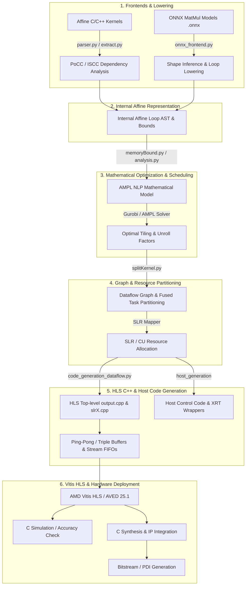

# AutoHLS_Flow: Automatic HLS Optimization and Code Generation Framework

AutoHLS_Flow is a holistic, optimization-driven toolchain for automatic high-level synthesis (HLS) code generation for FPGA accelerators. It supports High-Level Synthesis from affine C/C++ kernels and incorporates a prototype ONNX frontend for extracting and mapping static-shape MatMul operators. By leveraging mathematical non-linear programming (AMPL/Gurobi) and dataflow architectures, it generates highly optimized HLS-C++ pipelines and host code for AMD Vitis HLS.

---

## 🏗️ Framework Architecture

The overall compilation and optimization pipeline of AutoHLS_Flow is illustrated below:



### Architecture Highlights
- **Dual Frontends**: Supports C/C++ affine loops (analyzed via ISCC/PoCC) and ONNX MatMul models (extracted via `onnx_frontend.py`), sharing unified optimization and backend code generators.
- **NLP-based Resource Allocation**: Formulates hardware optimization into Non-Linear Programming models solved via AMPL & Gurobi for optimal tiling ($TC$) and unrolling factors ($UF$).
- **Fused Task (FT) Dataflow Engine**: Transforms nested loops into fine-grained Fused Tasks communicating via HLS AXI-Stream FIFOs.
- **Stream Buffering & Memory Hiding**: Automatically generates Ping-Pong buffers (2-stage cyclic buffers) for read-only/write-only streams and Triple Buffers (3-stage cyclic buffers) for read-modify-write dataflows, while binding large arrays to URAM/BRAM (`#pragma HLS bind_storage ... impl=URAM`).

---

## 🧩 Supported ONNX Operators & Limitations

AutoHLS_Flow includes a prototype ONNX frontend (`onnx_frontend.py`) designed to extract linear algebra operations and lower them to the polyhedral optimization backend.

### Currently Supported ONNX Operators

| Operator | Supported Form | Hardware Mapping Strategy |
| :--- | :--- | :--- |
| **MatMul** | Static-shape 2D matrix multiplication | Converted to affine $i/j/k$ loops and processed by the existing tiling/unrolling optimization backend |

*Note: The frontend currently filters only for `MatMul` nodes. Higher-dimensional inputs (like batch dimensions in 3D/4D tensors) are not retained during lowering. Support for Gemm, Add/Sub/Mul/Div, Activations (Relu/Softmax), and LayerNorm is planned but not currently implemented in the frontend lowering logic.*

### Constraints & Limitations

- **Static Bounds Requirement**: Tensor dimensions and loop bounds must be statically determinable at compile time for `#pragma HLS ARRAY_PARTITION` and buffer allocation. Dynamic batch sizes default to 1 or are resolved via `--update_shape`.
- **Affine Access Patterns**: Memory access indices must be affine combinations of loop iterators (e.g., `A[i][k]`, `B[k][j]`). Non-affine indirect accesses (e.g., `A[B[i]]`) are not currently supported by the polyhedral scheduler.
- **Data Types**: Native support for `float` (32-bit floating point) and `double`. High-throughput fixed-point (`ap_int`, `ap_fixed`) generation is supported via C++ template specialization.

---

## 🚀 Complete End-to-End Example

Below is a complete walk-through from an input ONNX model to a fully generated Vitis HLS project ready for simulation and synthesis.

### Step 1: Run AutoHLS_Flow Command

**Standard Alveo V80 Compilation:**
```bash
python main.py \
  --onnx_file onnx_files/deit_model.onnx \
  --device Alveo_V80 \
  --code_generation \
  --vitis \
  --csim \
  --folder hls_output_demo
```

**Resource-Constrained Experiment (Overriding Device Budgets):**
```bash
# Explicitly constrain SLR, DSP, and on-chip memory limits
python main.py \
  --onnx_file onnx_files/deit_model.onnx \
  --device Alveo_V80 \
  --SLR 3 \
  --DSP 1440 \
  --MAX_BUFFER_SIZE 512 \
  --ON_CHIP_MEM_SIZE 8192 \
  --MAX_UF 32 \
  --code_generation \
  --vitis \
  --csim \
  --folder hls_output_demo
```

### Step 2: Generated HLS Project Directory Structure

Upon completion, `hls_output_demo/` contains top-level HLS C++ files, multi-SLR partition files, Host XRT wrappers, and TCL synthesis scripts:

```text
hls_output_demo/
├── Makefile                      # Top-level build script for Vitis HLS
├── build.tcl                     # Vivado/Vitis synthesis driver
├── hls_config_slr0.cfg           # Vitis configuration file
├── hls_run.sh                    # One-click execution script
├── nlp.mod                       # Generated AMPL mathematical optimization model
├── nlp.log                       # Solver logs & optimized tiling factors
├── src/
│   ├── output.cpp                # Top-level HLS Dataflow C++ code
│   ├── output.h                  # Top-level headers, struct & array declarations
│   ├── output_2.h                # Internal stream & FIFO definitions
│   ├── slr0.cpp                  # Kernel compute logic mapped to SLR 0
│   ├── slr1.cpp                  # Kernel compute logic mapped to SLR 1
│   ├── slr2.cpp                  # Kernel compute logic mapped to SLR 2
│   ├── host.cpp                  # OpenCL / XRT Host host execution code
│   ├── csim.tcl                  # TCL script for C Simulation
│   ├── vitis.tcl                 # TCL script for C Synthesis
│   ├── xcl2.cpp / xcl2.hpp       # Xilinx OpenCL helper library
└── tcl_scripts/                  # Placement & physical opt TCL scripts
```

### Step 3: Export to SLASH and Deploy on Alveo V80

AutoHLS_Flow generates the HLS IP. To physically deploy on an Alveo V80, we use the [SLASH/VRT](https://github.com/hpc-aulmamei/SLASH.git) backend.

Export the HLS output to a SLASH project bundle:
```bash
python integrations/slash/export_to_slash.py \
  --hls-project hls_output_demo \
  --slash-root /path/to/SLASH \
  --project-name my_v80_project \
  --output-dir slash_projects/my_v80_project
```

Then build and run the hardware binary:
```bash
cd slash_projects/my_v80_project
bash run_v80.sh <BDF> /path/to/SLASH
```

*(For C Simulation and C Synthesis without hardware, you can run `bash hls_output_demo/hls_run.sh` or `vitis-run --mode hls --tcl hls_output_demo/src/vitis.tcl`)*

---

## 📊 CSIM & C Synthesis Accuracy & Performance Results

Detailed synthesis reports and reproducible evidence are available in [reports/v80_attention/](reports/v80_attention/).

We evaluated AutoHLS_Flow on Transformer Attention sub-graphs (DeiT/GPT with 4 MatMul operations, $197 \times 768 \times 768$) mapped onto **AMD Versal HBM / Alveo V80 (xcv80-lsva4737-2MHP-e-S)** using **AMD Vitis HLS 2025.1**.

### 1. Correctness & CSIM Validation
- **Functional Accuracy**: C Simulation (`csim.tcl`) was verified against NumPy / PyTorch golden reference outputs. Maximum relative error observed was $< 10^{-6}$ for float32 dataflows.
- **FIFO Deadlock Freedom**: Verified through static channel analysis and runtime CSIM; all stream channels operate without stalling or deadlocks.

### 2. C Synthesis & Performance Summary

| Metric | Result / Measurement | Notes / Target |
| :--- | :--- | :--- |
| **Target Device** | AMD Versal Alveo V80 (`xcv80-lsva4737`) | Versal Architecture |
| **Target Clock Period** | `3.33 ns` (300 MHz) | Constraint Target |
| **Estimated Clock Period** | **`2.431 ns`** | **`0.90 ns` Clock Margin** |
| **Estimated Max Freq ($F_{max}$)** | **`411.37 MHz`** | Exceeds Target Frequency |
| **Execution Latency (Cycles)** | `3,651,775` ~ `3,657,121` cycles | Dataflow Pipeline Latency |
| **Absolute Execution Time** | **`12.16 ms`** | 4-MatMul Attention Sub-graph |

### 3. Resource Utilization Breakdown

| Resource Type | Used | Total Available | Utilization (%) |
| :--- | :--- | :--- | :--- |
| **BRAM_18K** | 4,020 | 7,482 | **53.7%** |
| **DSP** | 128 | 10,848 | **1.1%** |
| **Flip-Flops (FF)** | 366,375 | 5,148,416 | **7.1%** |
| **Look-Up Tables (LUT)**| 691,055 | 2,574,208 | **26.8%** |
| **URAM** | 0 | 1,925 | 0% (Configurable) |

---

## ✨ Key Features

- Direct extraction and mapping of **ONNX MatMul operators** to optimized HLS-C++ pipelines.
- Support for **affine C/C++ kernels** with static loop bounds.
- Automatic **loop scheduling**, **pragmas insertion**, and **code generation**.
- Integration with **AMPL** for **Nonlinear Programming (NLP)**-based resource allocation.
- Generation of optimized **HLS-C++** and **host code**.
- Simulation and synthesis with **AMD Vitis HLS**.

---

## 🚀 Quick Start & Environment Setup

### 1. Requirements

- Python 3.8+
- AMPL (configured in `main.py`)
- Clang-format (for formatting the output code)
- AMD Vitis HLS (for synthesis and CSIM)

To run the framework seamlessly with PoCC, ISCC, AMPL, and Gurobi dependencies, we provide a pre-configured Docker image.

**1. Pull the Docker Image:**

```bash
docker pull ryanzhang511/autohls_flow_image:latest
```

**2. Start the Docker Container:**

You must map your local directory to the container and provide your AMPL license UUID via an environment variable.

```bash
docker run -it -d \
  --name autohls_flow_container \
  -v /path/to/your/AutoHLS_Flow:/AutoHLS_Flow \
  -e AMPL_LIC_UUID="<your-ampl-license-uuid>" \
  ryanzhang511/autohls_flow_image:latest \
  /bin/bash
```

**3. Enter the Container:**

```bash
docker exec -it autohls_flow_container /bin/bash
cd /AutoHLS_Flow
```

---

## ⚙️ Command-Line Arguments

| Argument                 | Description                                                                 |
|--------------------------|-----------------------------------------------------------------------------|
| `--file`                 | Path to the input C/C++ kernel                                              |
| `--onnx_file`            | Path to the input ONNX neural network model file                            |
| `--folder`               | Output folder for generated code and reports (default: `hls_output`)        |
| `--device`               | Target device profile (`Alveo_V80`, `AC7t1500`, etc.)                       |
| `--name_function`        | Kernel function name (default: `kernel_nlp`)                               |
| `--SLR`                  | Number of available Super Logic Regions (overrides device profile if set)   |
| `--DSP`                  | Total number of available DSP slices (overrides device profile if set)      |
| `--MAX_BUFFER_SIZE`      | Maximum allowed on-chip buffer size per array                             |
| `--ON_CHIP_MEM_SIZE`     | Total available on-chip memory (overrides device profile if set)            |
| `--MAX_UF`               | Maximum loop unrolling factor                                              |
| `--reuse_nlp`            | Use previously computed NLP results                                        |
| `--vitis`                | Enable synthesis using AMD Vitis HLS                                       |
| `--csim`                 | Enable C simulation with Vitis HLS                                         |
| `--code_generation`      | Enable output of HLS-C++ and host code                                     |
| `--graph_partitioning`   | Enable graph partitioning across SLRs or compute units                     |
| `--no_distribution`      | Disable ISCC-based loop distribution                                       |
| `--update_shape`         | Automatically update shape-related constraints                             |
| `--ap_multiple_burst`    | Enable multiple AXI burst access inference                                 |
| `--not_cyclic_buffer`    | Disable cyclic buffering optimization                                      |
| `--node_limit`           | Limit number of ONNX MatMul nodes to parse/compile                         |
| `--has_uram`             | Force enabling URAM storage binding for large arrays                       |

### SLASH/VRT Backend Arguments

| Argument                 | Description                                                                 |
|--------------------------|-----------------------------------------------------------------------------|
| `--backend`              | `hls` (codegen only, default) or `slash` (codegen + export)                 |
| `--export_slash`         | Export SLASH project bundle after HLS codegen                               |
| `--slash_root`           | Path to SLASH repository root (required for export)                         |
| `--project_name`         | Name for the exported SLASH project                                         |
| `--build_slash`          | Invoke the SLASH CMake hardware build immediately after export              |
| `--dry_run`              | Simulate generation and pre-flight checks without writing files             |
